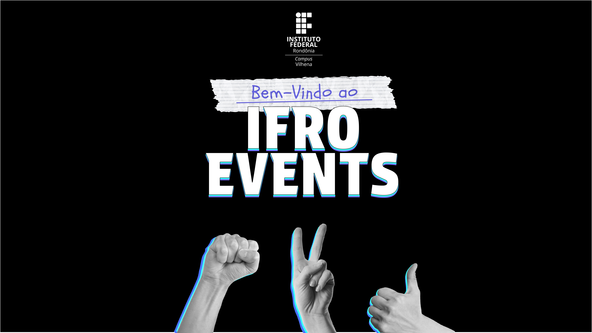

# PROJETO DE SOFTWARE - _Ifro Events_

## *STAKEHOLDERS*
|STAKEHOLDER|INTERESSE NO SISTEMA|
|:---|:---|
|Instituição de Ensino|Promover maior divulgação acerca dos eventos organizados, visando fornecer uma plataforma gratuita para serem usadas por usuários com algum tipo de ligação ao instituto.|
|Usuários|Obter acesso a divulgação e visualização dos eventos, garantindo uma participação mais ampla as atividades organizadas.|

# SUMÁRIO

* [RESUMO DO PROJETO](#resumo-do-projeto)
* [INTRODUÇÃO](#introdução)
  * [PROPÓSITO DESTE DOCUMENTO](#propósito-deste-documento)
  * [CONCEPÇÃO DO SISTEMA](#concepção-do-sistema)
* [DESCRIÇÃO GERAL](#descrição-geral)
  * [USUÁRIOS DO SISTEMA](#usuários-do-sistema)
  * [SISTEMAS SIMILARES](#sistemas-similares)
  * [SUPOSIÇÕES E DEPENDÊNCIAS](#suposições-e-dependências)
* [ESTUDO DE VIABILIDADE](#estudo-de-viabilidade)
* [METODOLOGIA ADOTADA NO DESENVOLVIMENTO](#metodologia-adotada-no-desenvolvimento)
* [REQUISITOS DO SOFTWARE](#requisitos-do-software)
  * [REQUISITOS FUNCIONAIS](#requisitos-funcionais)
  * [REQUISITOS NÃO FUNCIONAIS](#requisitos-não-funcionais)
* [PROTOTIPAGEM](#prototipagem)
* [EQUIPE DE DESENVOLVIMENTO E CLIENTE](#equipe-de-desenvolvimento-e-cliente)
  * [DESENVOLVEDORES](#desenvolvedores)
  * [CLIENTE](#cliente)
* [REFERÊNCIAS](#referências)

# RESUMO DO PROJETO

|ITEM| DETALHES|
|:---|:---|
| NOME|IFRO EVENTS. |
| Lider do Projeto|Luis Felipe Lopes. |
| Principal Objetivo |Prototipar uma plataforma de divulgação de eventos. |
| Benefícios Esperados |Facilitar a divulgação e a visualização dos eventos promovidos pelo instituto. |
| Início e Término Previstos |26/03/2025 - 16/07/2025. |

# INTRODUÇÃO
A plataforma "Ifro Events" nasceu da necessidade da divulgação de eventos promovidos ou organizados através do instituto. Utilizamos como referência a ideia de totens interativos, oferecendo flexibilidade e facilidade na visualização.  

## PROPÓSITO DESTE DOCUMENTO

O objetivo deste documento é descrever a concepção do sistema, seus requisitos, escopo e metodologia de desenvolvimento adotada, servindo como base para a equipe na implementação e sustentação do projeto.  

## CONCEPÇÃO DO SISTEMA

Métodos utilizados para a obtenção dos requisitos do sistema:  
  * Brainstorming e discussões entre os stakeholders;  
  * Análise de necessidades e expectativas de alunos;  
  * Protótipos no Figma;  
  * Definição de prioridades e funcionalidades-chave por meio de Kanban e Scrum.
    
---  

# DESCRIÇÃO GERAL

### USUÁRIOS DO SISTEMA
|USUÁRIO|DESCRIÇÃO|
|:---|:---|
|Administrador|Responsável pela gestão do sistema e administração e cadastro dos eventos mantidos no sistema.|
|Usuários|Consumidores do sistema e alvos da divulgação dos eventos.|

### SISTEMAS SIMILARES:
O projeto se assemelha a plataformas como Eventool(https://www.eventool.com), cujos objetivos incluem o gerenciamento e a divulgação de eventos com uma interface simples e funcional. No entanto, o “Ifro Events” busca oferecer uma experiência mais direcionada para totens interativos de acordo com as necessidades da divulgação dos eventos ofertados ou organizados pela instituição.

### SUPOSIÇÕES E DEPENDÊNCIAS

Os usuários poderão acessar a plataforma através de computadores ou totens interativos com acesso à internet para usufruir dos eventos disponibilizados na plataforma. Como se trata de uma aplicação interativa, o mínimo que espera-se é uma configuração de tela touchscreen para visualização e inteação com o sistema. No entanto, para os responsáveis pela administração do sistema, é recomendado o uso de um computador para a criação e gestão dos eventos, já que essas atividades exigem maior interação com as funcionalidades de gerenciamento.

---  

# ESTUDO DE VIABILIDADE

Após identificar um deficit acerca da divulgação dos eventos organizados, analisou-se a viabilidade técnica e financeira do projeto, considerando os recursos necessários para hospedagem, desenvolvimento e manutenção. Concluiu-se que a criação de uma plataforma para atender essa demanda é viável, trazendo benefícios de acessibilidade e flexibilidade.  

--- 

# METODOLOGIA ADOTADA NO DESENVOLVIMENTO
Foi adotado um modelo de desenvolvimento baseado em Kanban e Scrum, contemplando análise de Backlogs, para monitorar o progresso do projeto. Também foram utilizados protótipos no Figma para validação prévia da interface, além de revisões e ajustes contínuos com a equipe.  

[ [INÍCIO](#projeto-de-software---ifro-events) ]

---  

# REQUISITOS DO SOFTWARE

A especificação dos requisitos deste projeto segue as recomendações da norma IEEE Std-830-1998, considerando as boas práticas para definição de requisitos.  

## REQUISITOS FUNCIONAIS

A tabela a seguir contém a relação dos Requisitos Funcionais elicitados, com as colunas: identificador, nome e descrição:

| IDENTIFICADOR | NOME                    | DESCRIÇÃO                                                                                                                                          |  
|:-------------|:------------------------|:----------------------------------------------------------------------------------------------------------------------------------------------------|  
| **RF-001**   | Manter Cursos        | Permite o administrador criar, atualizar e remover cursos, bem como incluir conteúdos extras para disponibilizar aos alunos.             |
| **RF-002**   | Incorporar Vídeos     | Permite o administrador incorporar vídeos do Youtube.            |
| **RF-003**   | Gerenciar Conteúdo Extra | O administrador pode gerenciar os conteúdos extras dos cursos, como PDFs. |
| **RF-004**   | Manter Usuários |  Permite o administrador criar, remover e tornar administrador os usuários. |
| **RF-005**   | Acompanhar Progresso     | O administrador pode acompanhar o progresso dos alunos em cada curso. |
| **RF-006**   | Acompanhar o Próprio Progresso       | Os usuários podem acompanhar o próprio progresso em cada curso. |

## REQUISITOS NÃO FUNCIONAIS
A tabela a seguir contém a relação com os Requisitos Não Funcionais identificados, contendo identificador, nome e descrição:

| IDENTIFICADOR | NOME                           | DESCRIÇÃO                                                                                                |  
|:-------------|:-------------------------------|:----------------------------------------------------------------------------------------------------------|  
| **RNF-001**  | Desempenho e Escalabilidade                      | O sistema deve suportar simultaneamente pelo menos 100 usuários ativos sem degradação perceptível de desempenho, garantindo um tempo de resposta de no máximo 1 segundo. |  
| **RNF-002**  | Usabilidade                     | A interface deve ser intuitiva e claras tanto para administradores quanto para usuários. |  
| **RNF-003**  |Acessibilidade Multiplataforma             | O sistema será acessível via navegador, com design responsivo para dispositivos móveis, permitindo aos usuários acessarem os cursos de qualquer lugar. |
| **RNF-004**  | Formato Markdown                  | O sistema possuirá campos de textos em formato Markdown para que seja realizada a formatação da maneira que desejar nos campos de texto. |
---  

# PROTOTIPAGEM
Os protótipos de telas foram desenvolvidos no Figma, representando o fluxo de navegação, a apresentação das funcionalidades e o fluxo de gerenciamento dos eventos.  

**Figma:** [Ifro Events](https://www.figma.com/design/EZPCaUbsIDGNibsXkwhKEy/Eventos?node-id=0-1&t=LaEf47sO5ayA23wG-1)

## Fluxo Usuário
  

## Fluxo Administrador
  

[ [INÍCIO](#projeto-de-software---ifro-events) ]

# EQUIPE DE DESENVOLVIMENTO E CLIENTE

### DESENVOLVEDORES

|NOME|CARGO|E-MAIL|
|:---|:---|:---|
|Luis Felipe Lopes|Gerente de projeto/Analista|luis.felipe.lopes1275@gmail.com|
|Kauã Gabriel Peres Cruz|Analista|email|
|Deivid Luiz Costa Pereira|Analista|email|

### CLIENTE

|NOME|
|:---|
|Sankeis Pacheco de Oliveira da Silva|

# REFERÊNCIAS

Esta subseção apresenta as referências aos documentos que utilizamos no auxílio à construção deste documento.
* [Práticas para Especificação de Requisitos IEEE-830](https://ieeexplore.ieee.org/document/720574)
---  

[ [INÍCIO](#projeto-de-software---ifro-events) ]
